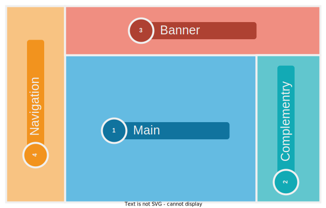
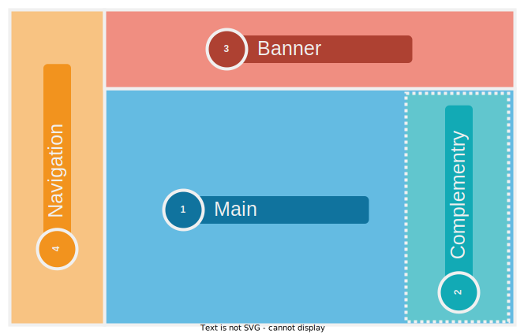
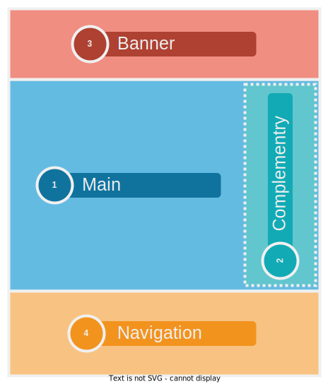
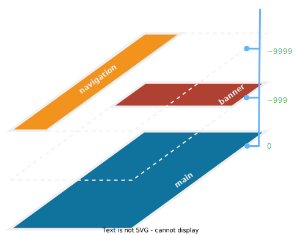
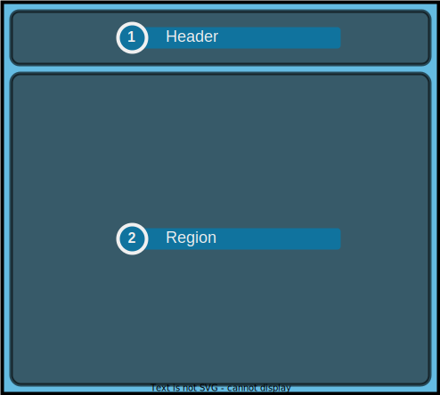

# Design Basis

## はじめに

このノートは、エンドユーザが使いやすいUXをもったWebアプリケーションを高速に開発するため、UIデザインの原則と、その実装のフレームワークをまとめるものです。

ベースとなる考え方として、以下を参照しています。

- [WAI-ARIA standard](https://www.w3.org/TR/wai-aria/)
- [Material Design](https://m3.material.io/)

### 適用アプリケーション

このノートにまとめられる原則およびフレームワークは

### Window class
root viewportの幅によって以下の3種類に区分します。

| Window class | identifier | root viewport size |
| --- | :---:  | ---: |
| Extra | `xl` | ≥1200px |
| Large | `lg` | ≥768px |
| Small | `sm` | <768px |

## トップレベル構成

### Landmarkの定義

トップレベルのlandmarkとして以下の4種類を定義します。

| # | landmark | label | role | 概要 |
| :---: | --- | --- | --- | --- |
| ① | Main | page-content | | ページのメインコンテンツが配置される領域 |
| ② | Complementry | page-complementry | | ページコンテンツのヘルプ情報が配置される領域 |
| ③ | Banner | site-header | | ブランドロゴやユーザアカウントステータスなどが配置される領域 |
| ④ | Navigation | site-navigation | | アプリケーションメニューが配置される領域 |

### 水平レイアウト

<table>
  <thead>
    <tr>
      <th>Window</th>
      <th>Layout</th>
    </tr>
  </thead>
  <tbody>
    <tr>
      <td style="vertical-align:top">Extra</td>
      <td> </td>
    </tr>
    <tr>
      <td style="vertical-align:top">Large</td>
      <td> </td>
    </tr>
    <tr>
      <td style="vertical-align:top">Small</td>
      <td> </td>
    </tr>
  </tbody>
</table>

### 垂直レイアウト

## ① Main landmark

Main landmarkは、ページの主コンテンツを表示する領域です。

| landmark | label | 概要 |
| --- | --- | --- |
| Header | page-header | |
| Region | page-body | |

### Header

### Region

## ② Complementry landmark

Complementry landmarkは、現在表示されているページに対応したヘルプ情報を表示する領域です。

## ③ Banner landmark

## ④ Navigation landmark

| Window class | 表示方式 |
| --- | --- |
| Extra | navigation rails, navigation drawerを常時表示 |
| Large | navigation railsを常時表示、navigation drawerをオーバーレイ |
| small | navigation barを表示 |

### Navigation Rail

### Navigation Drawer

### Navigation Bar

## スクロールバー

- 基本各landmarkで独立。
- headerは使用しないようにデザインする

### X軸
- contents area
  - Full：contens area + menu panelがroot viewportの幅を超える場合、contents areaにスクロールバーを表示
  - Small：contents areaがroot viewportの幅を超える場合、contents areaにスクロールバーを表示
- manu panel, option panel
  - 各paneにおいて、maxn-width設定を超える場合にそれぞれのpaneでスクロールバーを表示

### Y軸
- contents areaとheaderの合計値がroot viewportの高さを超える場合、contents areaにスクロールバーを表示
- menu panelとoption panelはそれぞれroot viewportの高さを超える場合、それぞれのpaneでスクロールバーを表示

